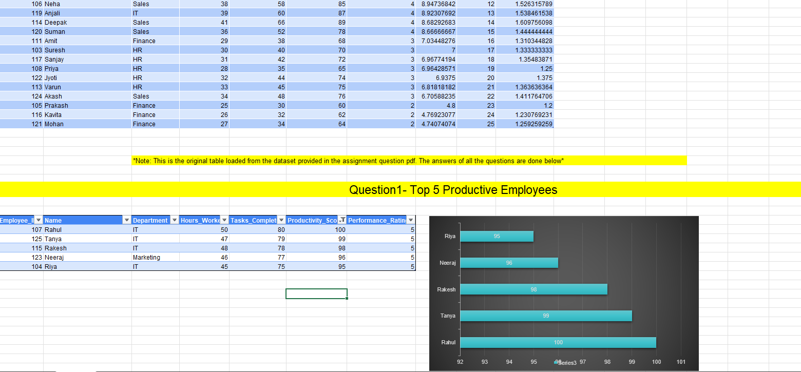

# Employee Work Productivity Analysis - Excel Assignment 1

Welcome to the **Employee Work Productivity Analysis** Excel assignment 1 repository, containing files and resources for my personal academic work.

## Overview

This assignment focuses on analyzing employee work productivity using Excel features such as data sorting, filtering, PivotTables, chart visualization, and calculating performance metrics like Productivity Efficiency Index (PEI) and Tasks per Hour (TPH).

## Preview

Here’s a preview of the Employee Work Productivity Analysis sheet:

