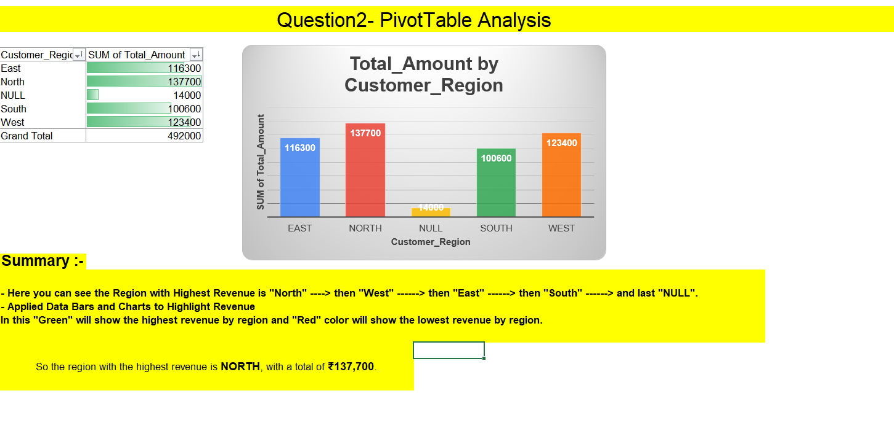

# Online Retail Sales Data - Excel Assignment 2

Welcome to the **Online Retail Sales Data** Excel assignment 2 repository, containing files and resources for my personal academic work.

## Overview

This assignment focuses on analyzing online retail sales data using Excel features such as data cleaning, PivotTables, lookup functions, trend analysis with charts, and calculating profit margins.

## Preview

Here’s a preview of the Online Retail Sales Data sheet:

