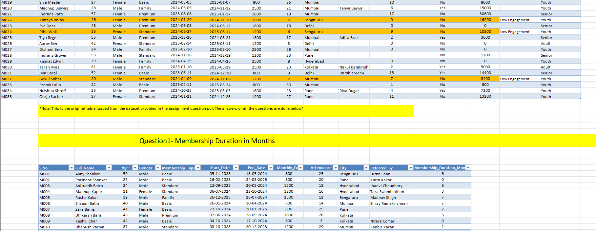

# Fitness Club Advanced Excel Analysis - Excel Assignment 3

Welcome to the **Fitness Club Advanced Excel Analysis** Excel assignment 3 repository, containing files and resources for my personal academic work.

## Overview

This assignment focuses on advanced Excel analysis for a fitness club, including data cleaning, creating PivotTables to analyze membership trends, city-wise distributions, and age group segmentation. It also involves calculating custom metrics, identifying profitable segments, and recommending strategies for marketing and referral programs based on profitability and member engagement.

## Preview

Here’s a preview of the Fitness Club Advanced Excel Analysis sheet:

