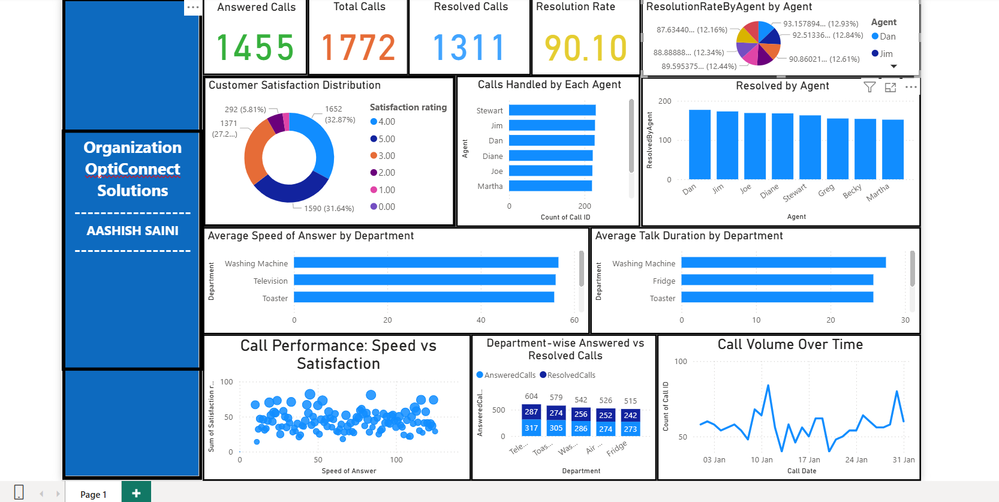

# 📊 OptiConnect Solutions - Call Center Performance Analysis (Power BI Dashboard)

This repository contains a Power BI dashboard Assignment developed to analyze and optimize call center performance for **OptiConnect Solutions**. As a data analyst, I leveraged Power BI to uncover actionable insights from call center operations data, focusing on improving speed of answer, resolution rates, customer satisfaction, and agent efficiency.

## Assignment Overview

OptiConnect Solutions, a reputed call center service provider, needed to enhance its customer experience by analyzing operational metrics such as:

- **Call Volume Over Time**
- **Speed of Answer**
- **Resolution Rates**
- **Average Talk Duration**
- **Customer Satisfaction Trends**
- **Agent Performance**

Using Power BI, this assignment visualizes key metrics, identifies hidden trends, and supports data-driven decision-making through an interactive dashboard.

## Screenshots
Here’s a snapshot of the interactive dashboard created for the **OptiConnect Solutions Call Center Performance Analysis** Assignment:

> This dashboard visualizes key metrics like Call Volume Trends, Speed of Answer vs. Satisfaction, Resolution Rates, and Agent Performance, providing actionable insights for decision-makers.

## Features

- 📈 **Line Chart** showing call volumes over time  
- 📊 **Scatter Plot** exploring the relationship between answer speed and satisfaction  
- 🎯 **KPI Cards** for average call duration, resolution rates, and satisfaction score  
- 📅 **Date Filtering** for dynamic time-based analysis  
- 📌 **Agent-wise Insights** to highlight top performers and improvement areas  
- 🧠 **Professional Branding Sidebar** with embedded personal contact and portfolio links

## Tools & Technologies

- Power BI Desktop  
- DAX for calculated columns and measures  
- Power Query for data cleaning and transformation