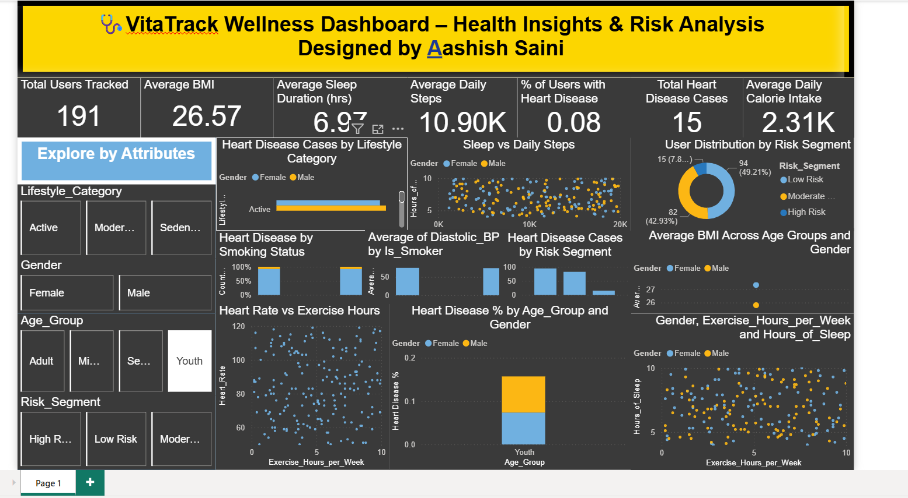

# 🩺 VitaTrack Wellness - Health & Activity Dashboard (Power BI Assignment)

This repository contains a Power BI dashboard assignment developed for **VitaTrack Wellness** to explore and visualize health and activity data. As a data analyst, I utilized Power BI to gain actionable insights into lifestyle patterns, risk factors, and health outcomes such as heart disease prevalence, physical activity, and sleep habits.

---

## 📌 Assignment Overview

**VitaTrack Wellness**, a health analytics initiative, aims to improve well-being by analyzing individual health metrics and behaviors. The dashboard provides interactive visualizations to assist in:

- 🚶‍♂️ **Daily Steps & Sleep Patterns**
- ❤️ **Heart Disease Prevalence**
- 🚭 **Smoking vs Heart Risk Analysis**
- 🧠 **Lifestyle Risk Segmentation**
- 🏋️ **Exercise vs Heart Rate**
- 📊 **BMI, Blood Pressure, and Calories Trends**

This project enables a better understanding of health data to support wellness decisions.

---

## 📷 Dashboard Screenshot

> The dashboard highlights lifestyle categories, heart health trends, and wellness indicators like BMI, steps, and sleep—allowing stakeholders to identify risk patterns and target interventions.

---

## 🔍 Features

- 🔢 **KPI Cards** for BMI, Blood Pressure, Steps, Sleep, Heart Disease %, etc.  
- 📈 **Scatter Plots** for:
  - Sleep vs Daily Steps  
  - Sleep vs Exercise Hours  
  - Heart Rate vs Exercise Hours  
- 📊 **100% Stacked Column** for Smoking vs Heart Disease  
- 🔀 **Interactive Slicers** for:
  - Age Group
  - Gender
  - Lifestyle Category
  - Is Smoker
  - Has Heart Disease
  - Risk Segment
- 🧮 **DAX Measures** for heart disease %, average steps, average sleep, and more  
- 🎨 **Clean Layout** with slicer section and modern visuals

---

## 🛠️ Tools & Technologies

- Power BI Desktop  
- Power Query for data cleaning  
- DAX (Data Analysis Expressions) for custom calculations  
- Scatter, column, card, and KPI visualizations