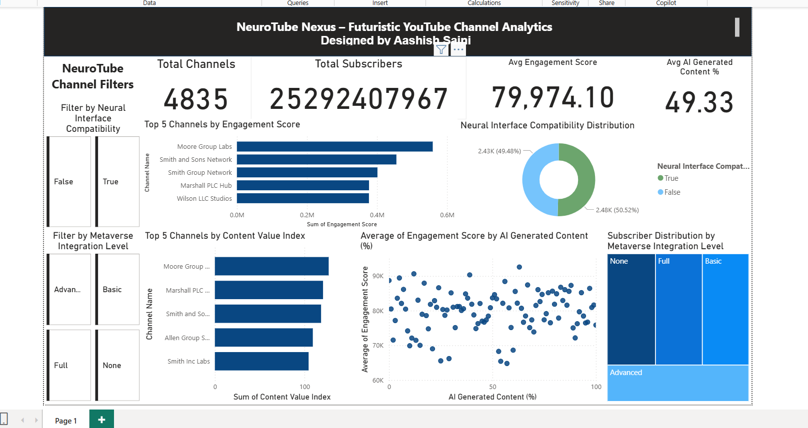

# 🧠 Organisation NeuroTube Nexus - Futuristic Media Channel Analysis Dashboard (Power BI)

This repository contains an interactive Power BI dashboard designed for **Organisation NeuroTube Nexus**, a futuristic digital platform analyzing YouTube-like channel metrics involving AI-generated content, metaverse integration, and neural interface compatibility. The objective was to evaluate content performance, audience engagement, and technological integration trends across media channels in the year 2025.

---

## 📌 Project Objective

To build a comprehensive and insightful Power BI dashboard that uncovers:

- 📊 Channel-wise Engagement Score & Content Value Index  
- 🤖 AI-generated content influence  
- 🧬 Neural Interface Compatibility  
- 🌐 Metaverse Integration Levels  
- 👥 Subscriber Distribution  
- 🔍 Advanced filtering and segmentation capabilities  

This dashboard empowers decision-makers to identify high-performing futuristic media channels and understand technology adoption trends.

---

## 📷 Dashboard Snapshot

> The dashboard combines KPIs, bar charts, treemaps, donut charts, and slicers to present actionable insights across multiple futuristic attributes.

---

## 💡 Key Features

- 🔢 **KPI Cards**:
  - Total Channels  
  - Total Subscribers  
  - Avg. Engagement Score  
  - Avg. % of AI-Generated Content  

- 📊 **Bar Charts**:
  - **Top 5 Channels by Engagement Score**  
  - **Top 5 Channels by Content Value Index**

- 🍩 **Donut Chart**:
  - Neural Interface Compatibility (True/False distribution)

- 🧱 **Treemap**:
  - Metaverse Integration Levels (None, Partial, Advanced, Full) vs Subscriber Counts

- 🎛️ **Interactive Slicers**:
  - Neural Interface Compatibility  
  - Metaverse Integration Level  

- 🛠️ **Custom Tooltips**:
  - Hover to view additional insights like Avg Video Length, Total Videos, and Subscribers.

---

## 🛠️ Tools & Technologies

- Power BI Desktop  
- DAX (Data Analysis Expressions)  
- Power Query for preprocessing  
- Custom filtering (Top N filters, slicers)  
- Visual types: Card, Bar, Treemap, Donut, KPI, Tooltip configuration  

---

## 🧮 Aggregations & Logic

- **Engagement Score**: Average for KPIs, used as-is in visuals  
- **Content Value Index**: Average or direct column values (no aggregation for Top 5)  
- **Subscriber Count**: Aggregated as Sum for treemap and cards  
- **AI Content %**: Average for summary card  
- **Filters**: Top N filters applied on Channel Name with values like Engagement Score / Content Value Index  